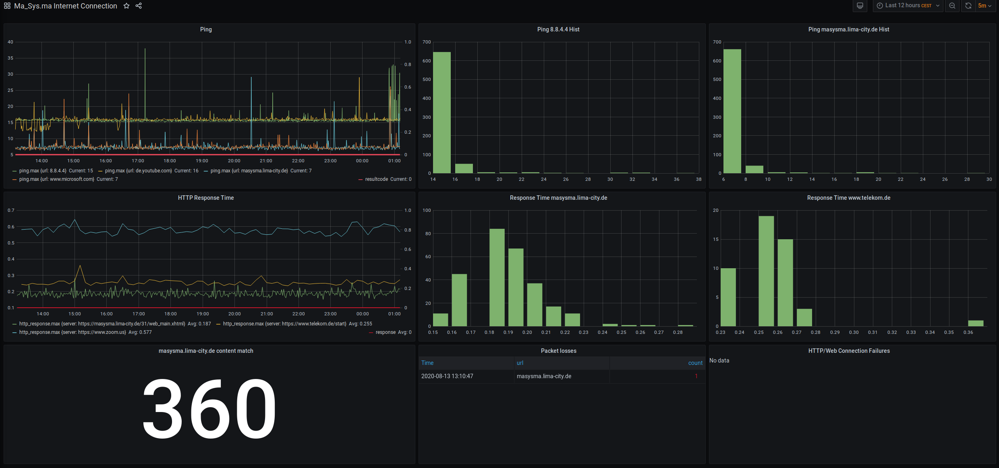
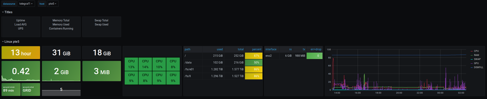
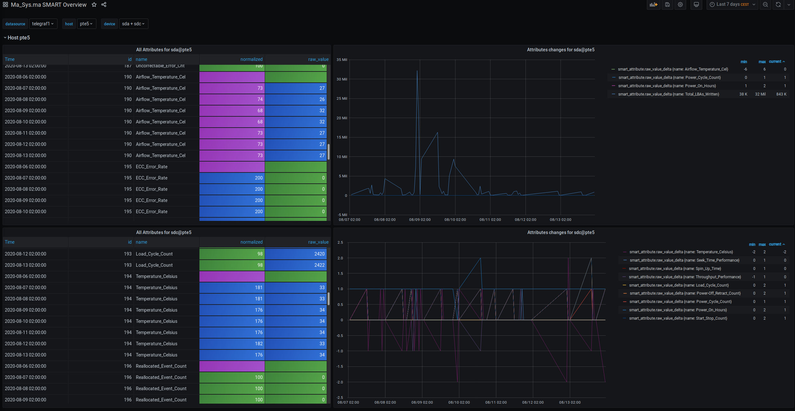

Overview
========

This repository contains resources for building a local system monitoring
composed of the following components:

 * Grafana dashboards
    * _Few Systems_ dashboard to do basic Linux system monitoring
    * _Internet Connectivty_ dashboard to monitor connection outrages
    * _SMART_ dashboard to view HDD health information across systems
 * Influxdb database
 * Telegraf for metric acquisition
 * Docker for running the server-side components

This is largely running as-is at the Ma_Sys.ma. The following components might
be interesting in other contexts, too:

 * Configuration settings for running the services with Docker.
 * Dashboard configurations.

## System Composition

The idea of this repository is to provide sample configuration for the following
use case:

 * Centralized monitoring server (_server_)
 * Multiple clients sending metrics to the server (_clients_)

To do this, the server runs the following services as individual Docker
containers:

 * `grafana` -- Dashboard exposed on port 3000.
   Users intending to view the dashboards connect to this endpoint.
 * `influxdb` -- Database, only locally accessible
 * `telegraf-iconqualmon` -- Telegraf instance for acquiring Internet
   Connectivity metrics. May be left out if not needed.
 * `stunnel` -- TLS endpoint exposed on port 5086.
   Telegraf instances on the clients connect to this endpoint.

All of these services are defined in `server/docker-compose.yml`. All of their
configuration files are collected in directory `server`. Their connections among
each other could be visualized as follows:

    .             //////////////////////////////////////////////////////////////
                  //////////////////////////////////////////////////////////////
                  /////                                                    /////
         o        /////  Server-Side (running in containers)               /////
        _|_       /////                                                    /////
         |        /////  +------+---------+                                /////
        / \ ---> exposed   3000 | grafana |                                /////
      Client      /////  +------+---------+                                /////
      (User)      /////            ^                                       /////
                  /////            |                                       /////
                  /////  +------+----------+     +----------------------+  /////
                  /////  | 8086 | influxdb | <-- | telegraf-iconqualmon |  /////
    //////////    /////  +------+----------+     +----------------------+  /////
    //      //    /////            ^             (optional for Internet    /////
    // Cli- //    /////            |              connectivity monitoring) /////
    // ent  //    /////  +------+---------+                                /////
    //      ---> exposed   5086 | stunnel |                                /////
    // Tel- //    /////  +------+---------+                                /////
    // egr- //    /////                                                    /////
    // af   //    //////////////////////////////////////////////////////////////
    //////////    //////////////////////////////////////////////////////////////

The clients connect using Telegraf. System metrics are best acquired by running
on the actual system. Hence, Telegraf is run as a regular systemd service (not
in a Docker container).

Database connections are secured using TLS server and client certificates. As
Influxdb does not support client certificates directly, `stunnel` is used to
handle TLS traffic.

Each host will need individual configuration e.g. graphics card metrics may
not be available on all hosts, VMs will need different metrics compared to
physical systems etc. To address this need, a script to generate an installation
script for Telegraf is provided as `genclientinstaller.sh`. See section
_Client Installation_ for details.

Server Installation
===================

## TLS Configuration Preparation

Before running the server, necessary TLS certificates and keys need to be
gernated. Directory `scripts-tlsmanagement` contains some scripts to
simplify the process (a little).

The following certificates and keys are needed in the end:

 * CA private key (`ca.key`)
 * CA certificate (`ca.cer`)
 * Server certificate (`server.cer`)
 * Server private key (`server.key`)
 * Client certificate (`client.cer`)
 * Client pirvate key (`client.key`)

### 1. Configure Server Host IP

Proper TLS requires that certificates match the hosts they are created for.
`stunnel` can be configured to ignore this such that the individual clients do
not need their certificates to be tied to their hostnames or IP addresses. For
the server side, however, the server's hostname (or IP) needs to match whats
given in the certificate thus the first step is to write the server's IP
address to file `scripts-tlsmanagement/keys/extfile.cnf`. For instance, if
the server's address is 192.168.1.139, then configure the file as follows:

	subjectAltName = IP:192.168.1.139

### 2. Generate CA and Server Keys

Script `scripts-tlsmanagement/geninitialkeys.sh` generates the CA and server
keys and certificates using the following openssl commands:

~~~{.bash}
# set RSA strength in bits
strength=8192
# generate CA certificate
openssl req -nodes -newkey rsa:$strength -keyform PEM -keyout keys/ca.key -x509 -outform PEM -out keys/ca.cer
# generate server key
openssl genrsa -out keys/server.key $strength
# generate server certificate signing request
openssl req -new -key keys/server.key -out keys/server.req -sha256
# sign the server's key using the CA's certificate
openssl x509 -req -days 36500 -in keys/server.req -CA keys/ca.cer -CAkey keys/ca.key -CAcreateserial -outform PEM -out keys/server.cer -sha256 -extfile keys/extfile.cnf
~~~

All resulting keys are written to the `keys` directory. Note that expiry is set
to 100 years here to avoid monitoring from stopping due to key expiry. If you
consider it important, you can of course set a shorter validity.

### 3. Generate Client Key

Generate a client key using script `scripts-tlsmanagement/genclientkeys.sh`
which runs the following commands:

~~~{.bash}
# generate client key
openssl genrsa -out "keys/$clnt/client.key" "$strength"
# generate client certificate signing request
openssl req -new -key "keys/$clnt/client.key" -out "keys/$clnt/client.req"
# sign the client's key using the CA's certificate
openssl x509 -req -in "keys/$clnt/client.req" -CA keys/ca.cer \
			-CAkey keys/ca.key -extensions client -outform PEM \
			-out "keys/$clnt/client.cer"
~~~

### 4. Distribute Keys to the Server

By configuration from `stunnel.conf` and `docker-compose.yml`, the following
key files are required on the server:

 * `keys-server/server.key` -- the server's private key. Copy over from
   `scripts-tlsmanagement/keys`.
 * `keys-server/server-ca.cer` -- the server's certificate (`server.cer`)
   followed by the CA's certificate (`ca.cer`) concatenated in the same file.
 * `keys-server/allclients.cer` -- all of the clients' certificates concatenated
   into a single file.

A working set of files can be obtained by performing the following steps:

~~~{.bash}
# copy server's private key
cp keys/server.key ../server/keys-server
# assemble server's certificate among with the CA's certificate
cat keys/server.cer keys/ca.cer > ../server/keys-server/server-ca.cer
# assemble all client keys
cat keys/*/client.cer > ../server/keys-server/allclients.cer
~~~

## Password Configuration

Passwords can be configured either through environment variables or directly in
`docker-compose.yml`. To easily set the environment variables, create file
`server/.env` with contents of the following scheme (without the comments).

	GF_SECURITY_ADMIN_PASSWORD=password1         # Grafana password
	INFLUXDB_ADMIN_PASSWORD=password2            # Influxdb admin password
	INFLUXDB_READ_USER_PASSWORD=password3        # Influxdb read-only
	INFLUXDB_WRITE_USER_PASSWORD=password4       # Influxdb write-only
	MASYSMAWRITER_PASSWORD=password4
	MASYSMAREADER_PASSWORD=password3

Passwords `INFLUXDB_READ_USER_PASSWORD` and `MASYSMAREADER_PASSWORD` as well
as `INFLUXDB_WRITE_USER_PASSWORD` and `MASYSMA_READ_USER_PASSWORD` need to match
(otherwise database connectivity will fail).

## Internet Connectivity

If you want to use the _Internect Connectivity_ dashboard, be sure to configure
different URLs and servers in `server/iconqualnmon/telegraf.conf`

## Run

The containers can be started with `docker-compsoe` from directory `server`:

	# docker-compose up grafana influxdb stunnel

If you have configured the _Internet Connectivity_ settings in
`server/iconqualnmon/telegraf.conf` you can start all containers (i.e. including
the optional `telegraf-iconqualmon` service) with:

	# docker-compose up

By default, all data will be stored within the respective containers. While this
allows easy testing and cleanup, it also effectively disables persistence. Once
you intend to run the containers more permanently, edit `docker-compose.yml` and
enable the commented-out mappings from the `volumes` sections. Change the
host-side according to your local configuration and then re-create all
containers and this time run them with `docker-compse up -d` to run them in
background.

Client Installation
===================

If you are running the _Internet Connectivity_ dashboard, the server
installation may be enough. If you want to monitor individual systems, of
course, they need to run a local Telegraf instance to gather system metrics.

Script `scripts-clientmon/genclieninstaller.sh` is prepared to generate
installation scripts to be used to install the client on Debian systems. The
idea is to package all necessary key material, configuration and setup scripts
into a single “installer script” such that adding new clients is reasonably
easy.

Before using it, create a file `.env` next to `genclientinstaller.sh` with the
following conents:

~~~
keydir=".../clients/$1"
cacert=".../ca.cer"
MASYSMA_INFLUXDB=...
~~~

The dots need to be set according to your local file structure and network:

`keydir`
:   Set this to a directory where the key material for the current client can
    be found.
`cacert`
:   Set this to the `ca.cer` file's location
`MASYSMA_INFLUXDB`
:   Set this to the server's hostname where the Influxdb is running.

After this configuration, invoke

~~~
$ ./genclientinstaller.sh <client> > install-on-<client>.sh
~~~

to generate a setup script. This will include the key material and configuration
data to use on that client. Be sure to tweak the generated `telegraf.conf`
before running `install-on-<client>.sh` on the target machine as root.

Note: By its original package, Telegraf runs as a separate user. Given that it
might be interesting to also monitor Docker, however, it becomes necessary to
effectively give root permissions to Telegraf (either by adding it to the
`docker` group or by running it as root). If you do not want to monitor Docker
(or SMART or other things that require root), consider changing
`genclientinstaller.sh` accordingly.

Dashboards
==========

## Internet Connectivity

This dashboard is intended to show a continuous measure of connection quality
be displaying the timings of regular ping packets and TCP connections.

Note: In case you configured different hostnames in Telegraf, you may need to
edit the panels to use your host names as filters rather than the ones provided
in the sample configuration.

The screen is divided into nine parts with three entries per row.

In the first row, all times are given in milliseconds.

First row: _Ping_
:   Probably the most important panel. This is displaying the timings of
    ping requests. Faolied pings are indicated by a spike in the bold red line
    `resultcode`.

This panel's queries are largely independent of the configuration:

~~~{.sql}
SELECT max("maximum_response_ms") FROM "ping" WHERE $timeFilter
				GROUP BY time($__interval), "url" fill(null)`
SELECT MAX("result_code") FROM "ping" WHERE $timeFilter
				GROUP BY time($__interval) fill(null)
~~~

First row: _Ping Hist_
:   A histogram of ping results. Here, one can see that most pings
    finish in just under 16 ms and only a small fraction requires more than
    18 ms.

The qureies' WHERE clauses need to be edited to match the Telegraf
configuration:

~~~{.sql}
-- For ping 8.8.4.4
SELECT max("maximum_response_ms") FROM "ping" WHERE url = '8.8.4.4'
			AND $timeFilter GROUP BY time($__interval) fill(null) 
-- For ping masysma.lima-city.de
SELECT max("maximum_response_ms") FROM "ping" WHERE url = 'masysma.lima-city.de'
			AND $timeFilter GROUP BY time($__interval) fill(null) 
~~~

In the second row, all times are given in seconds.

Second row: _HTTP Response Time_
:   Similar to the _Ping_ panel, this one displays the duration of the download
    of a small webpage through HTTPS. Again, a bold red line `response` may
    spike to show failed connections.

The queries for this panel are generic again:

~~~{.sql}
SELECT max("result_code") FROM "http_response" WHERE $timeFilter
				GROUP BY time($__interval) fill(null)
SELECT max("response_time") FROM "http_response" WHERE $timeFilter
				GROUP BY time($__interval), "server" fill(null)
~~~

Second Row: _Response Time_ Historgram
:   Presents a histogram display of the measured HTTP response times.

~~~{.sql}
-- Response time masysma.lima-city.de
SELECT max("response_time") FROM "http_response"
	WHERE ("server" = 'https://masysma.lima-city.de/31/web_main.xhtml')
		AND $timeFilter GROUP BY time($__interval) fill(null)
-- Response Time www.telekom.de
SELECT max("response_time") FROM "http_response"
	WHERE ("server" = 'https://www.telekom.de/start')
		AND $timeFilter GROUP BY time($__interval) fill(null)
~~~

The third row is dedicated to displaying numbers of failures.

Third row: _content match_
:   This special panel shows the number of times the content retrieved through
    HTTPS matched the expectations. One can see that in the screeshot, all
    360 connections were successfully returning the expected content. For this
    matching to work, you need to configure the `response_string_match` and
    `urls` in Telegraf:

	# server/iconqualnmon/telegraf.conf excerpt
	[[inputs.http_response]]
	  interval = "120s"
	  urls = ["https://masysma.lima-city.de/31/web_main.xhtml"] # CONFIGURE HERE
	  response_timeout = "4s"
	  method = "GET"
	  response_string_match = "<h1>Ma_Sys.ma Startseite"        # CONFIGURE HERE
	  follow_redirects = false

The panel's queries also need to be configured to use the correct URL:

~~~{.sql}
-- match (generic)
SELECT COUNT("result_code") FROM "http_response"
	WHERE "response_string_match" = 1 AND $timeFilter
-- mismatch (configuration required)
SELECT COUNT("result_code") FROM "http_response"
	WHERE ("result_code" <> 0 OR "response_string_match"  = 0)
		AND "server" = 'https://masysma.lima-city.de/31/web_main.xhtml'
		AND $timeFilter
~~~

Third row: Tables
:   The remaining two panels show exact counters for failed pings and failed
    HTTP connections respectively. The tables are generic and need not be
    configured.

~~~{.sql}
-- Table: Packet losses
SELECT COUNT("result_code") FROM "ping" WHERE ("percent_packet_loss" > 0 OR
		"result_code" = 1) AND $timeFilter GROUP BY "url" fill(none)
-- Table: HTTP/Web Connection Failures
SELECT COUNT("result_code") FROM "http_response"
		WHERE (http_response_code <> 200 OR response_string_match = 0 OR
			result_code <> 0) AND $timeFilter GROUP BY "server";
~~~

## Few Systems Overview

This dashboard is intended to show the system health and load for about three
systems (depending on screen space). It works for Linux systems and degrades
gracefully if some non-essential metrics are missing.

The first six fields for each system are as follows:

 1. Uptime Indicator:
    The first item displayed is the system's uptime.
    This metric is important to see if a server that should be always online
    has been restarted recently.
 2. Total RAM Indicator
 3. Total SWAP Indicator
 4. Load Average Indicator
 5. RAM used indicator
 6. SWAP used indicator

The following fields are present under special cirumstances:

apcupsd panel
:   If connected to an UPS supported by `apcupsd` (and enabled in Telegraf),
    two metrics are displayed: `.remain` displays the time the UPS may stay
    on battery as of now and `onbat` displays `GRID` while the system is
    attached to external power and the time the UPS has been running on battery
    if not. If `apcupsd` data is not available, the whole field will display
    `NO UPS`.

Docker Containers panel
:   Displays the number of running Docker conatiners (if reported by Telegraf).

Note: It would be interesting to display the status of RAID arrays, too, but
Telegraf does not provide this as a metric.
_TODO z: It should be possible to do this by parsing `/proc/mdstat`, though._

After these special panels follow some larger tabular-style panels:

 * CPU load panel with individual CPU loads
 * File system use table
 * Network Interface rx/tx and error data.
   _TODO z: It would be interesting to show IP addresses here, but Telegraf
   does not seem to collect them._

The last panel is a diagram which displays all the important system metrics in
a single chart:

 * CPU load (averaged across all cores; 100% means all cores are 100% loaded)
 * RAM usage
 * SWAP usage
 * GPU usage (as reported by `nvidia-smi`, if the metric is collected)
 * Disk usage: `DISKFULL` reports the percentage used for the “fullest” file
   system. The idea is that if you run out of disk space (on any disk), this
   line will approach 100%.

## HDD S.M.A.R.T Values

This advanced dashboard is intended to provide an overview of the S.M.A.R.T
data across the HDDs and SSDs installed across multiple systems. It is highly
experimental and hints for making it more useful are welcome!

For each HDD, two panels are displayed:

Table: All Attributes
:   This table is intended to show the S.M.A.R.T values in numeric form.
    By using different colors, it tries to distinguish common values like 0
    or 100 from less common ones. It will at most display one value per day
    as S.M.A.R.T data is not expected to change too rapidly.

Note: The table in their current form could see some improvements wrt. the
units of data displayed and wrt. displaying only the relevant one of
`normalized` and `raw_value`. The problem here is that the interpretation of
attributes is manfacturer and thus essentially drive-specific and Grafana does
not seem to provide a convenient means to attach the device-specific information
to the table (short of hand-crafting the table for each and every invidiual
drive).

Diagram: Attribute changes
:   Displays the differences in attributes across time.
    As of now, the diagram is not overly useful as it displays values that
    change with +1 or +2 alongside values which change +32M or +38K... Here, one
    may better consult the table displayed alongside the diagram and maybe
    consult the diagram only for the individual values
    (by clicking on one of the attributes)

Additional Security Considerations
==================================

While the setup proposed here has some security, it is weak in at least
the following regards:

 * _All clients share the same client certificate_.
   `stunnel` documentation describes that it should be possible to provide
   _multiple_ client certificates in a CAfile, however this did not seem to
   work when tested. Only the first certificate listed was ever accepted. Hence
   the idea to use only one certificate at all. Another approach might be to use
   certificate directories (instead of a single file) which should allow for
   multiple client certificates.

 * _Grafana access is not secured_. To complete the secure setup, TLS access
   should be used for accessing the Grafana dashboards, too. While it is of
   less concern if the dashboards are expected to be publically viewable, it
   may still sometimes be needed to access the admin ínteraface and this access
   should be encrypted such that attackers cannot sniff the login information
   from packets transmitted over network.
